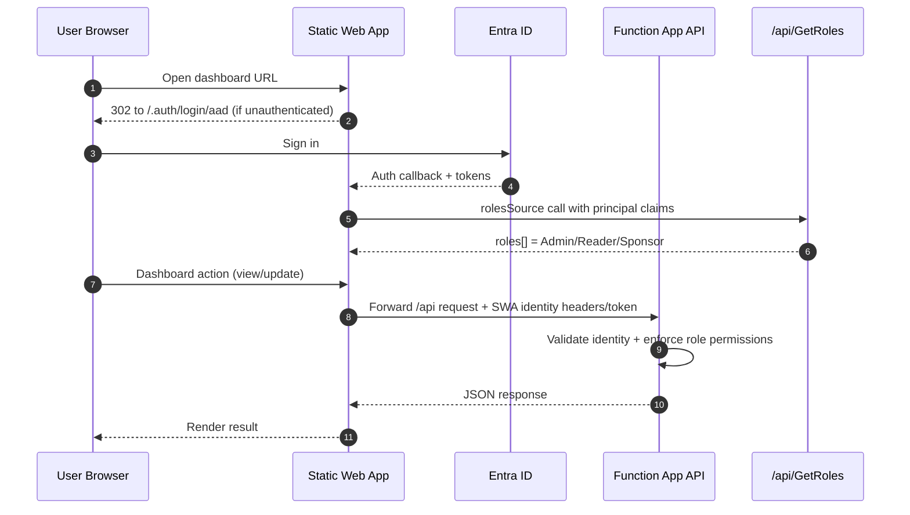
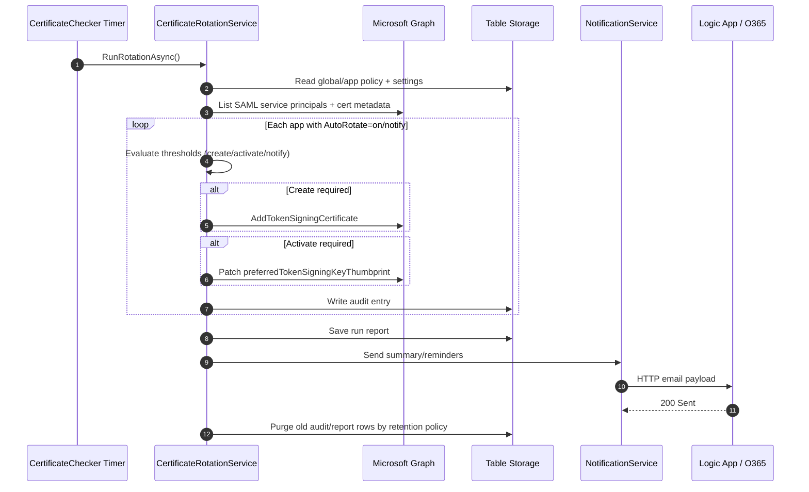

# Azure Hosted Architecture (One-Page)

This document summarizes how the SAML Certificate Rotation Tool runs in Azure.

## Topology (Natural Language)

- **Frontend**: Azure Static Web App (Standard) hosts the dashboard SPA and enforces login via Entra ID using `dashboard/staticwebapp.config.json`.
- **API/compute**: .NET 8 isolated Azure Functions on Consumption plan (`Y1`) hosts all HTTP APIs and timer jobs, deployed by `infrastructure/main.bicep`.
- **Identity for backend**: A User-Assigned Managed Identity is attached to the Function App and used with `DefaultAzureCredential` for Microsoft Graph in `src/SamlCertRotation/Program.cs`.
- **Data/config persistence**: Azure Table Storage stores policies (`RotationPolicies`), audit logs (`AuditLog`), and run reports (`RunReports`) via services under `src/SamlCertRotation/Services`.
- **Secrets**: Key Vault stores the storage connection string, Logic App callback URL, and SWA client secret references.
- **Notifications**: Logic App (HTTP trigger) + Office 365 connector sends email notifications; Functions call it through `LogicAppEmailUrl`.
- **Monitoring**: Application Insights is wired to Log Analytics workspace.

## 1) Component Architecture

```mermaid
flowchart LR
  U[End User\nAdmin / Reader / Sponsor] --> SWA[Azure Static Web App\nDashboard SPA + Auth Gateway]

  SWA -->|/api/* via linked backend| FUNC[Azure Function App (.NET 8 Isolated)\nHTTP APIs + Timer Jobs]

  SWA -->|OIDC login| AAD[Microsoft Entra ID\nApp Registration + Enterprise App]

  FUNC -->|Managed Identity token| GRAPH[Microsoft Graph API\nService Principals / SAML Certs]

  FUNC -->|Table SDK| STG[(Azure Table Storage\nRotationPolicies\nAuditLog\nRunReports)]

  FUNC -->|Key Vault references| KV[Azure Key Vault\nStorageConnectionString\nLogicAppEmailUrl\nSWA client secret reference]

  FUNC -->|HTTP POST| LA[Azure Logic App\nHTTP Trigger]
  LA --> O365[Office 365 Outlook Connector]
  O365 --> MAIL[Email Notifications\nSponsors + Admins]

  FUNC --> AI[Application Insights]
  AI --> LAW[Log Analytics Workspace]
```

## 2) Request & Authorization Sequence



### Request/Auth Flow (Natural Language)

- User hits SWA; unauthenticated users are redirected to `/.auth/login/aad`.
- SWA calls `rolesSource` at `/api/GetRoles`; Function maps Entra group/app-role claims to `Admin`/`Reader`/`Sponsor` in `src/SamlCertRotation/Functions/RoleFunctions.cs`.
- SWA forwards API calls to linked Function backend; API routes require authenticated role access (`/api/*` protected by SWA config).
- Function-side auth pipeline in `src/SamlCertRotation/Functions/DashboardFunctionBase.cs` validates identity and enforces per-endpoint role checks.

## 3) Rotation Runtime Sequence (Scheduled)



### Certificate Rotation Runtime (Natural Language)

- Scheduled engine: `CertificateChecker` timer (`RotationSchedule`) runs daily by default.
- For each SAML service principal (via Microsoft Graph), it evaluates certificate expiry and policy thresholds to:
  - create new cert near expiry,
  - activate pending cert closer to expiry,
  - support `on`, `notify`, `off` via Entra custom security attribute.
- Mode control: report-only vs production comes from persisted settings in Table Storage.
- Every run writes audit entries, persists compressed run reports, sends summaries/reminders, and purges old logs/reports based on retention settings.
- Monthly stale-cert reminder timer sends cleanup notices (`StaleCertCleanupSchedule`).

## 4) Key Hosting Decisions in This Repo

- Frontend and auth boundary are handled by Static Web Apps (`dashboard/staticwebapp.config.json`).
- API uses Azure Functions Consumption plan with a user-assigned managed identity (`infrastructure/main.bicep`).
- Function App uses Key Vault references for non-platform secrets; platform storage settings remain direct connection strings (required by Consumption mounting behavior).
- App RBAC is role-based (`Admin`, `Reader`, `Sponsor`) and mapped by `GetRoles`.
- Data persistence is Azure Table Storage only (no SQL dependency).
- Email delivery is decoupled through Logic App + Office 365 connector.
- Observability uses App Insights connected to a Log Analytics workspace.

## 5) Operational Characteristics (Natural Language)

- Security boundary is Entra Enterprise App assignment + SWA auth + API role checks.
- Secrets are not hardcoded; sensitive values are retrieved through Key Vault references.
- CORS is limited to SWA hostname from Bicep configuration.
- Easy Auth on Function App is intentionally disabled after SWA backend linking; SWA is the auth front door (per deployment guide).
- Architecture is serverless and cost-efficient, but depends on external Microsoft Graph / Logic App / Office 365 availability.

## 6) SWA Token Trust Model (Architecture Security)

The Function App supports three auth paths, in this order:

1. Entra ID token validation (OIDC metadata, issuer/audience/signature checks)
2. `x-ms-client-principal` header from SWA reverse proxy
3. SWA-issued JWT with issuer matching to configured SWA hostnames

Because path 2 and path 3 rely on SWA acting as the trusted ingress, deployment assumes:

- Requests flow through Static Web App backend-link routing.
- `SWA_DEFAULT_HOSTNAME` / `SWA_HOSTNAME` are correctly configured in Function App settings.
- Direct end-user access to the Function App `*.azurewebsites.net` URL is not part of normal access flow.

Defense in depth recommendation: use Function App access restrictions to limit direct inbound paths where operationally feasible.
